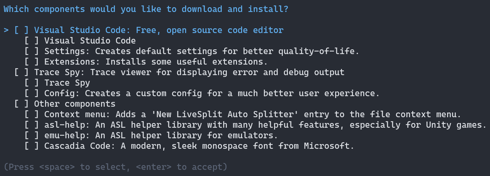

# asl-utils

***asl-utils*** is a program that allows beginner developers to easily and quickly download and install several tools helpful for creating their LiveSplit auto splitters.

## Features

***asl-utils*** is currently able to do the following things:

* Download and install [Visual Studio Code](https://code.visualstudio.com), *a modern, free, open source code editor*.
  * Alter some Visual Studio Code settings to make development more robust.
  * Install some Visual Studio Code extensions to make the experience more smooth.

* Download and install [Trace Spy](https://github.com/smourier/TraceSpy), *a trace viewer for displaying error and debug output*.
  * Alter some Trace Spy settings for much better user experience.

* Create a custom context menu entry to create a 'New LiveSplit Auto Splitter'.
  * The template file is located at `%APPDATA%/Microsoft/Windows/Templates`.

* Download several helper libraries ([`asl-help`](https://github.com/just-ero/asl-help), [`emu-help`](https://github.com/Jujstme/emu-help)).

* Download and install [Cascadia Code](https://github.com/microsoft/cascadia-code), *a sleek monospace font*.

## Usage

***asl-utils***' usage is self-explanatory:

1. Simply download and extract the `.zip` file from the [latest release](https://github.com/just-ero/asl-utils/releases/latest),
2. run the extracted `asl-utils.exe` file,
3. choose what to install:  

